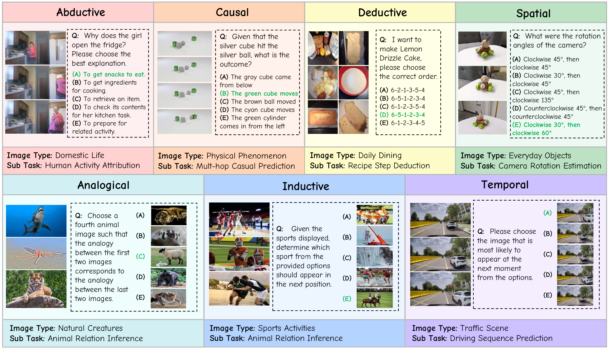

# MMR-Life Benchmark

[**🌐 Homepage**](https://mmr-life-bench.github.io/) | [**🤗 Dataset**](https://huggingface.co/datasets/Septzzz/MMR-Life) |  [**📖 Paper**](https://openreview.net/pdf?id=ds8bBklDV5) 

This repo contains the evaluation code for the paper "[MMR-Life: Piecing Together Real-life Scenes for Multimodal Multi-image Reasoning](https://openreview.net/pdf?id=ds8bBklDV5)"


## Introduction

MMR-Life consists of 2,646 multiple-choice questions based on 19,108 images, comprehensively covering 7 reasoning types (i.e., abductive, analogical, causal, deductive, inductive, spatial, and temporal) and 21 tasks. Each task is based on a set of multi-images, predominantly sourced from real-life contexts, such as domestic life, daily dining, and sports activities. The questions in our benchmark do not require domain-specific expertise but instead ask models to extract key information from multiple real-life images and derive new conclusions. This design aligns MMR-Life more closely with the reasoning types found in everyday life.




## Evaluation

This repository contains the evaluation suite for testing Multimodal Large Language Models (MLLMs). The framework supports multiple reasoning methods, Best-of-N reranking using reward models, and token efficiency analysis.

### 1. Initialization & Setup

Before running the evaluation, ensure the environment and the model server are properly initialized.

+ **Data Loading**

  The evaluation script loads images and JSON metadata from the specified paths. Please ensure your data is prepared by downloading it from the official repository:  [**🤗 MMR-Life**](https://huggingface.co/datasets/Septzzz/MMR-Life). Ensure your local data directory is structured as follows:

  + Images: Stored in the corresponding directory specified by the img_path in the JSON data.
  + JSON Data: MMR_Life.json or MMR_Life_mini.json.

+ **Model Deployment**
  We recommend using [**vLLM**](https://github.com/vllm-project/vllm) to deploy open-source models as an OpenAI-compatible API server for optimal performance.

  + Example: Deploying Qwen2.5-VL-7B

    ```
    vllm serve huggingface/Qwen2.5-VL-7B-Instruct --task generate --trust-remote-code --port YOUR_PORT --api-key YOUR_KEY --served-model-name Qwen2.5-VL-7B --limit-mm-per-prompt.image 32 
    ```

    **Note:** Ensure that the --port and --url in your `run_exp.py` execution command match this deployment.

    

### 2. Main Inference & Answer Extraction

In this phase, the model generates multiple reasoning paths based on the configured strategy by running `run_exp.py`.

- **Prompting**: A specific system prompt (e.g., `cot`, `direct`) is selected via the `--method` argument.

- **Sampling**: The model generates $N$ responses per question (controlled by `--n_sample`).

- **Inference Options** (controlled by `--option`):

  - **Base Inference (`default`):** Uses direct answer or CoT prompting to inference the questions.
  - **Reward Modeling (`rm`):** Uses the **Skywork Reward Model** to score multiple candidates and select the optimal response based on reward scores.
  - **Usage Profiling (`usage`):** Specifically tracks `prompt_tokens` and `completion_tokens` to calculate computational cost.

- **Extraction**: The `extract_answer` function parses the raw model output to isolate the final prediction.

  **Verification**: The system compares the `pred_answer` against the `golden_answer` to determine the `correct` flag for each sample.

Example:

```
python run_exp.py --model Qwen2.5-VL-7B --method cot --option default
```


### 3. Result Analysis

The `parse_result.py` script provides a comprehensive suite of tools to analyze model performance across multiple dimensions, including reasoning types, computational efficiency, and scaling behaviors.

| **Analysis Module**         | **Function**          | **Description**                                              |
| --------------------------- | --------------------- | ------------------------------------------------------------ |
| **Reasoning Type Analysis** | `get_model_result`    | Calculates accuracy per task type (e.g., Abductive, Spatial). |
| **CoT / Thinking Gain**     | `comp_nothinking_acc` | Measures the accuracy delta between direct answering (`direct`) and Chain-of-Thought (`cot`). |
| **Token Efficiency**        | `comp_token_acc`      | Profiles **Accuracy vs. Completion Tokens** to find the most cost-effective models. |
| **Visual Complexity**       | `split_image`         | Evaluates model robustness across **Low, Mid, and High** image counts per question. |
| **Method Comparison**       | `cal_method_acc`      | Compares **Base CoT**, **SC@8**, and **Best-of-N (BoN)** using Reward Models. |
| **RL vs. SFT Impact**       | `comp_rl_bon`         | Analyzes performance gains from Reinforcement Learning (e.g., *MiMo-VL-SFT* vs. *RL*). |


## Contact

Jiachun Li: 1641412838@qq.com


## Citation

**BibTeX:**

```bibtex

```